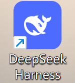
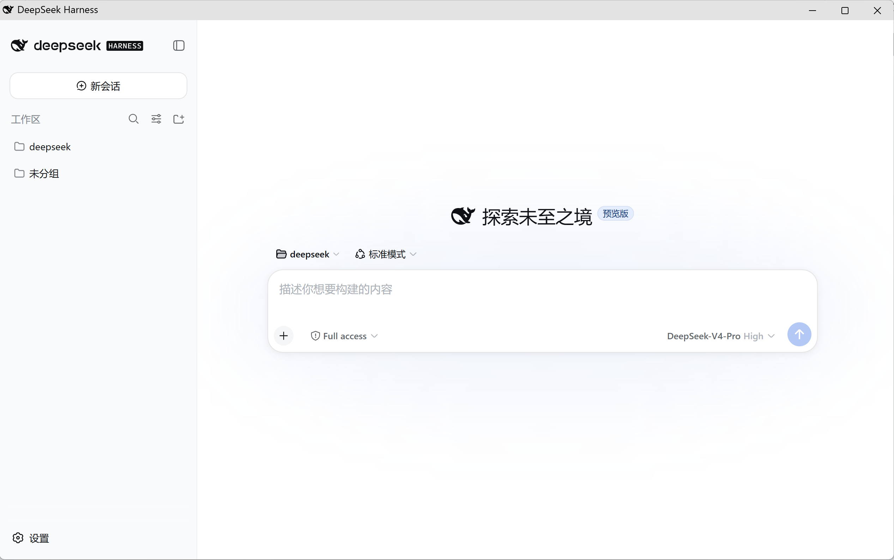

# DSH Web 启动器（Windows）

[](https://github.com/topics/dsh-plugin)
[](LICENSE)

让 `dsh web` 像普通桌面软件一样运行：**本质是原生 Web，视觉上是桌面软件**。首次启动后自动创建桌面图标，之后双击图标即可打开独立窗口。

- **本质是原生 Web**：背后就是官方 `dsh web` 服务，没有 Electron、没有二次打包、没有 fork，功能与 Web 版完全一致；
- **视觉上是桌面软件**：窗口由 Edge/Chrome/Brave/Vivaldi 的 `--app` 模式打开，没有标签栏和地址栏，看起来与原生桌面应用无异；
- **生命周期像桌面软件**：双击图标启动、关闭窗口即退出，临时浏览器 profile 用完自动删除。

这是非官方社区插件，与 DeepSeek 官方无隶属或背书关系。

## 效果图

**桌面快捷方式图标**（首次运行 `dsh web` 后自动创建）：



**应用模式独立窗口**（视觉上是桌面软件，本质是原生 Web UI；无标签栏、无地址栏，关闭窗口即退出）：



## 插件安装

本项目是标准 `dsh.bundle` 插件。社区发布后，用户只需要安装插件：

```powershell
dsh plugin --profile web add github:sylkmpo/dsh-web-app-launcher
```

然后首次运行一次 Web profile：

```powershell
dsh web
```

插件激活时会自动在桌面创建 **DeepSeek Harness.lnk**。之后直接双击该图标即可：

- 使用 Edge、Chrome、Brave 或 Vivaldi 打开独立应用窗口
- 没有标签栏和地址栏
- 关闭窗口后自动退出 Harness
- 不创建 `D:\dsh-web-launcher-test` 之类的独立安装目录
- 临时 Chromium profile 使用系统临时目录，窗口退出后自动删除

首次运行 `dsh web` 是必要的，因为 `dsh plugin` 只负责安装插件，插件代码要在 Web profile 激活后才能创建 Windows 快捷方式。

## 卸载

```powershell
dsh plugin --profile web remove dsh-web-app-launcher
```

删除插件后，可以直接删除桌面上的 **DeepSeek Harness.lnk**。

## 系统要求

- Windows 10 或 Windows 11
- Node.js
- 已安装 DeepSeek Harness，并且 `dsh` 在 PATH 中

```powershell
npm install -g @deepseek-ai/dsh
```

## 开发检查

```powershell
Get-ChildItem tests -Filter *.ps1 | ForEach-Object {
  powershell -NoProfile -ExecutionPolicy Bypass -File $_.FullName
}
```

## 许可证

MIT，详见 [LICENSE](LICENSE)。
